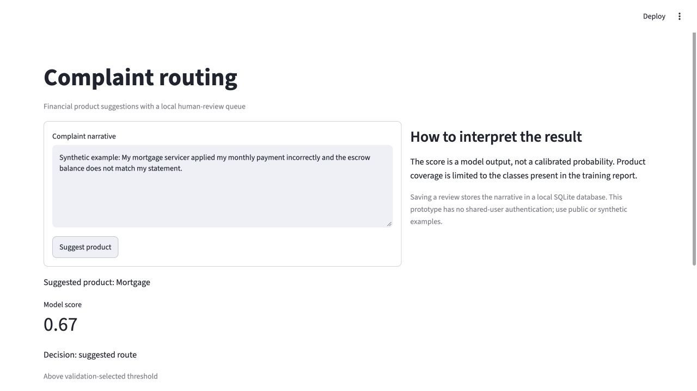
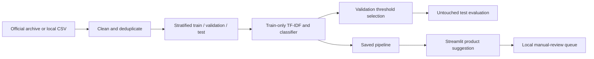

# Complaint Routing: Evaluated NLP Application

Classify financial complaint narratives into product categories and send uncertain cases to a local human-review queue.



## Problem

Complaint triage needs more than a predicted label. This application pairs a reproducible text classifier with class-level evaluation, a validation-selected routing threshold, and a review workflow. The original exploratory [notebook](complaints.ipynb) remains available alongside a separate executable training and inference path.

## Dataset / Source

The new evaluation uses a seeded sample of **10,000 public narratives** from the [CFPB July 2026 archive](https://www.consumerfinance.gov/foia-requests/foia-electronic-reading-room/cfpb-consumer-complaint-database-narratives-archive/). After removing unusable text, normalized exact duplicates, conflicting labels, and classes with fewer than 20 examples, **9,375 records** remain.

This is a new evaluation, not a rerun of the notebook's previously documented 887,808-record experiment. [Provenance](reports/provenance.json) records the archive URL, checksums, sampling method, and source counts. Raw narratives and trained artifacts stay local.

## Tech Stack

Python · pandas · scikit-learn · TF-IDF · SGDClassifier · Streamlit · SQLite · pytest

## Architecture / Workflow



The vectorizer is fitted only on training data. Exact normalized narrative duplicates are removed before splitting. A majority-class baseline makes the improvement explicit. Scores are not calibrated probabilities.

## Results / Metrics

Reproducible sample run: **5,625 training, 1,875 validation, and 1,875 test records**, with seed 42.

| Held-out test metric | Majority baseline | TF-IDF + SGD |
|---|---:|---:|
| Accuracy | 0.241 | 0.788 |
| Macro F1 | 0.035 | 0.700 |
| Weighted F1 | 0.094 | 0.782 |

At the validation-selected score threshold of **0.50**, **43.8%** of test cases qualified for a suggested route, with **94.0%** accuracy within that subset. The remaining cases require review. These sample results do not guarantee future performance.

Inspect [full evaluation and limitations](reports/evaluation.json), [per-class precision/recall/F1](reports/per-class.csv), and the [confusion matrix](reports/confusion-matrix.csv). Runtime versions are recorded in the evaluation report. Threshold selection uses validation data only, targeting at least 85% accuracy among at least 20 accepted validation cases. If no threshold qualifies, all cases require review.

## Project Files

| File | Purpose |
|---|---|
| [download_sample.py](routing/download_sample.py) | Download the fixed official archive and select a reproducible sample |
| [model.py](routing/model.py) | Data validation, splitting, baseline, training, evaluation, and routing |
| [train.py](routing/train.py) | Training command-line interface |
| [app.py](routing/app.py) | Local product suggestion and review interface |
| [queue.py](routing/queue.py) | Persistent SQLite queue and reviewed-product decisions |
| [tests](tests) | Input, duplicate, threshold, persistence, training, and interface checks |

## How to Run

```bash
python3 -m venv .venv
source .venv/bin/activate
pip install -r requirements-app.txt
python -m routing.download_sample
python -m routing.train --csv data/complaints.csv
streamlit run routing/app.py
```

For an existing CFPB CSV, skip downloading and provide a file containing `Product` and `Consumer complaint narrative` columns. The downloader uses the archive because the live API no longer supplied narratives during this implementation.

```bash
python -m routing.train --csv /path/to/complaints.csv --output artifacts --reports reports
python -m pytest -q
```

The trained model defaults to `artifacts/routing.joblib`; override with `ROUTING_MODEL`. Only load a locally trained or otherwise trusted joblib file. `REVIEW_QUEUE` sets the SQLite path (default `data/review-queue.sqlite`). No complaint is sent to an external service by the app. Clicking **Save to manual-review queue** stores it locally; **Complete review** records the reviewed product. High-scoring suggestions can also be reviewed.

## What This Demonstrates / Production Improvements

**Implemented:** train-only feature fitting, duplicate handling before splitting, a measured baseline, minority-class evaluation, model persistence, inference, threshold-based abstention, review completion, and automated checks.

**Limits:** the sample covers one archive segment; random splitting does not measure temporal drift, near-duplicates may remain, rare classes are excluded, and unfamiliar products may receive an incorrect confident label. The application is a local prototype without shared-user authentication. Use public or synthetic examples.

**Next steps:** chronological evaluation, probability calibration, out-of-distribution detection, review feedback evaluation, drift monitoring, and authenticated deployment. Review decisions are retained but are not automatically used for retraining.
